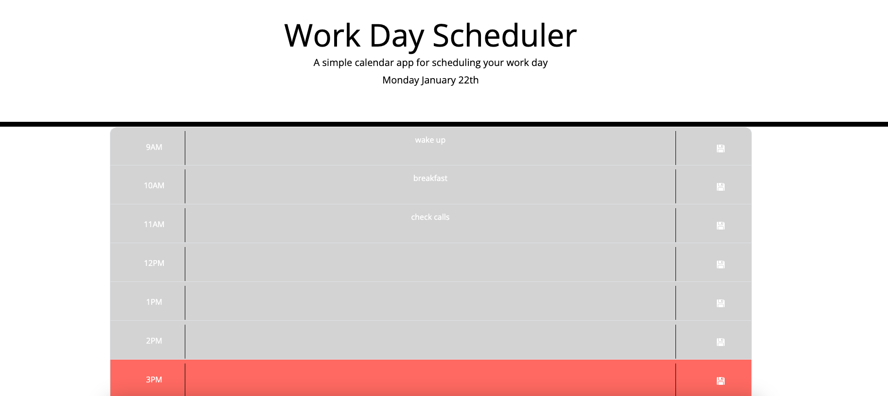

# Work Day Scheduler

## Objective
Build a dynamic daily planner application utilising Bootstrap for styling, jQuery for dynamic updates, and Day.js for real-time date and time handling.

## Goal
The application provides a user-friendly interface for managing and saving daily events. It features timeblocks for standard business hours, which change colour in real time to reflect past, present, and future, using Day.js. Events are saved to local storage for persistence between page refreshes.

## Preview

## Deployment
[Visit the Live Application](https://calebtkjordan.github.io/work-day-scheduler/)